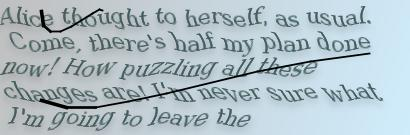
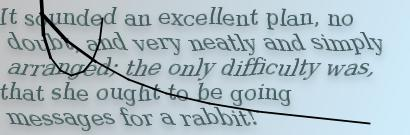
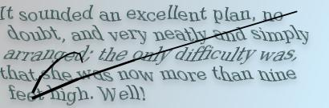

# TypeRacer Bot
Summary: Bot joins typeracer session, types fast, then has to solve captcha

note: set ```headless: false``` in ```runner.js``` to see it in action

## captcha example:


<br>


## Solving the problem
1. play typeracer, when capthca comes up, take image url

2. download image into ram and run through converter that removes black lines and noise, then download into ./tmp/tmp.jpg

3.  go to https://www.prepostseo.com/image-to-text and upload image

4.  extract text and run through cleanup.js (uses hidden api of https://languagetool.org/)

5.  go back to typeracer and type in clean text


## Investigating The Captchas

### 1, check for duplicate images
I tried to compare the images directly to see if there was a finite set of captcha images. I tested with 240 images, and got no duplicates. Therefore I concluded that the images were uniquely generated. This means that I couldn't just mine all pictures, but had to identify the text in the images. 
<br>

### 2, compare text of images
I parsed the images through a regular img to text api and got semi-good results. The generated text wasn't accurate enough, but it was close. <br>
I compared the text of each image with the text of each image, here are the top results. 

```
0.58 for 1649230928808.jpg and 1649231195913.jpg 
0.59 for 1649230691576.jpg and 1649229480508.jpg 
0.61 for 1649230690515.jpg and 1649227771559.jpg 
0.61 for 1649230602318.jpg and 1649228069137.jpg 
0.62 for 1649231088278.jpg and 1649228253351.jpg 
0.62 for 1649227770760.jpg and 1649229482685.jpg 
```

The best results were about 60% similar. Here is the top result

 


We can see that the images share similar text, even the alterations seem simmilar. However they seem to differ at the ending. This makes me think the captchas aren't exact cuts out of a text. I think there's a text from which all captcha texts are generated. Either through an AI generator or an algoritm that cuts and pastes parts. This idea is further reinforced by the sentences being completely uncoherent and without meaning.

A lot of captions seem to include the words Alice and rabbit, therefore the original text is probably Alice's Adventures in Wonderland, but there could possibly be more source material aswell

One solution is to solve these captchas with an accurate image recognition AI that can read the text. We could also run it through a spellchecker to further improve accuracy.

Another option is the find the source material for Alice's Adventures in Wonderland and try to put the pieces together.


Since the black lines going through thing seem to be the thing that mess everything up, You could just mine a LOT of images who all have randomely generated black lines, then take the most common output (which is when word isn't covered by black line) and go to that if it's similar.
<br>
